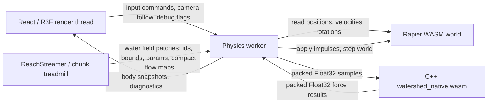

# ADR: Rapier and C++ WASM Water-Force Coupling

Status: accepted for v1

## Context

Watershed now has two WebAssembly runtimes:

- Rapier, compiled from Rust, owns rigid bodies, colliders, contacts, integration, and broad/narrow phase collision.
- `watershed_native.wasm`, compiled from C++ with Emscripten, owns specialized water-force math: buoyancy, drag, flow momentum, and deterministic turbulence.

The game needs the raft to react immediately to water while preserving Rapier as the rigid-body authority.

## Decision

Run C++ water-force calculation in the same worker as Rapier for the production path.

Use a single physics tick:

1. Read raft/body state from Rapier in the physics worker.
2. Pack compact water samples into a persistent C++ WASM heap input buffer.
3. Run `computeWaterForcesBatch(...)`.
4. Read output forces from the persistent output buffer.
5. Apply `force * dt` impulses to Rapier bodies.
6. Step Rapier.
7. Post the compact body state snapshot back to the render thread.

Do not use a second worker for v1. A second worker would add one more scheduling boundary and either require delayed force application or a synchronization protocol. That hurts the speed feel more than the current force math helps.

Do not require `SharedArrayBuffer` or Atomics for v1. They are viable later, but they require cross-origin isolation headers and complicate local/static deployment.

## Data Flow



Frame-local sample buffer:

```txt
input stride, 8 floats:
[posX, posY, posZ, velX, velY, velZ, flowDirX, flowDirZ]

output stride, 8 floats:
[forceX, forceY, forceZ, buoyancy, drag, flow, turbulence, submergedRatio]
```

## Minimal State Per Body

Per water sample:

- Position: `x, y, z`
- Linear velocity: `x, y, z`
- Local sampled flow direction: `x, z`

Per force batch:

- `flowSpeed`
- `waterLevel`
- raft or body mass
- raft or body volume
- drag coefficient
- frontal area
- side area
- simulation time
- turbulence strength/frequency

Orientation is not required by the current C++ ABI. When hull sampling becomes orientation-aware, derive sample positions in the Rapier worker from the rigid-body rotation and write those sample positions into the same input stride. Avoid shipping quaternions to C++ unless C++ starts doing hull sampling itself.

## Why Same Worker

Same worker advantages:

- No postMessage hop between Rapier state and C++ forces.
- No one-frame force latency.
- One authoritative physics clock.
- Easier deterministic replay and diagnostics.
- C++ can be called after reading Rapier state and before stepping Rapier.

Dedicated second worker is reserved for future heavier water simulation where:

- A water field evolves independently over many cells.
- It can tolerate one-frame latency.
- It communicates through `SharedArrayBuffer` with deployment headers guaranteed.

## Synchronization

v1 synchronization is synchronous inside the physics worker:

```txt
for each physics tick:
  collect Rapier body samples
  update active water field/chunk params
  compute C++ force batch
  apply impulses to Rapier
  world.step()
  post body snapshots to render
```

The render thread never waits on C++ directly. It only receives snapshots from the physics worker.

## Chunk And Treadmill Streaming

Water data should follow the existing reach/chunk treadmill:

1. `ReachStreamer` fetches manifest assets and water-field metadata outside Suspense.
2. The render thread sends only compact water-field patches to the physics worker:
   - chunk/reach id
   - world-space bounds
   - water level
   - base flow speed
   - turbulence parameters
   - optional compact flow-map texture data or decoded float field
3. The physics worker keeps a small active-ring cache keyed by chunk id.
4. When TrackManager recycles a chunk, send an evict message for that water field.

The C++ force call should receive sampled local flow direction and scalar params, not full chunk assets every frame.

## Performance Budget

60 fps frame budget is 16.67 ms. Native water force work should stay below 0.5 ms per physics frame, with a target below 0.2 ms.

Initial content budget:

- Player raft: 4 to 8 hull samples per frame.
- Test/floating debris: 16 objects.
- Upper v1 budget: 128 samples per frame.
- Stress budget before redesign: 512 samples per frame.

Local benchmark on this workspace, Node 24.14.1, generated `public/watershed_native.wasm`, 20,000 iterations:

| Path | Samples | Time |
|------|---------|------|
| Embind scalar `calculateWaterForce` | 1 | 4.851 us/call |
| Batch `computeWaterForcesBatch` | 1 | 0.436 us/batch |
| Batch `computeWaterForcesBatch` | 8 | 0.725 us/batch |
| Batch `computeWaterForcesBatch` | 32 | 5.868 us/batch |
| Batch `computeWaterForcesBatch` | 128 | 15.390 us/batch |
| Batch `computeWaterForcesBatch` | 512 | 51.523 us/batch |

At 128 samples, the native calculation is roughly 0.015 ms locally, leaving budget for Rapier and worker messaging. Browser measurements should be captured before raising the sample cap.

## POC

Run:

```txt
?wasmWaterTest=1&no-pointer-lock=1
```

This mounts `WasmWaterForceTest`:

- Rapier owns the dynamic raft body.
- Fixed Rapier colliders form canyon walls and a midstream obstacle.
- C++ `calculateWaterForce(...)` computes the per-frame water impulse.
- The scene writes the latest state to `window.__watershedWasmWaterTest`.

The POC is intentionally isolated behind a URL flag and does not replace the normal raft controller.

## Biome Math V1

Slot canyon:

- `flowSpeed`: 4.0 to 7.0 m/s
- `turbulenceStrength`: 0.06 to 0.14
- Narrow cross-current pulse from position/time seeded sine terms.
- High drag and side-area response for wall-riding and ferry-angle feel.

Glacial melt:

- `flowSpeed`: 1.5 to 3.0 m/s
- `turbulenceStrength`: 0.02 to 0.06
- Lower base momentum, later augmented with sharper lateral fields around ice and rocks.

## Consequences

Positive:

- No additional worker hop on the core physics loop.
- Small data boundary: tens or hundreds of floats, not large arrays.
- Works without cross-origin isolation.
- Keeps Rapier as the single collision/integration authority.

Tradeoffs:

- Rapier worker now owns native water-module lifecycle.
- Long-running C++ water simulation cannot block the physics worker; full grid/fluid simulation must stay separate later.
- Browser-specific performance numbers still need capture before increasing sample counts above 128.
